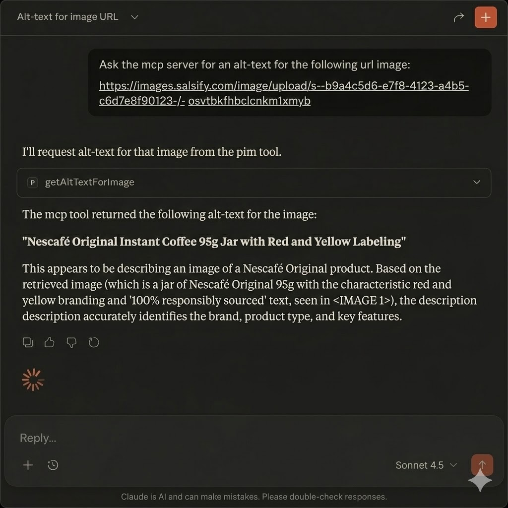

# POC

This is a POC of a service using AI Agents where there is a Model Context Protocol (MCP) server and one MCP Client that will interact with the MCP server and external services.

## Technologies used

- [x] Node.js
- [x] TypeScript
- [x] AWS SAM
- [x] AWS Lambda
- [x] AWS API Gateway
- [x] Google Gemini
- [x] Claude Desktop

## How to run it locally

Since the MCP Client doesn't have a real use beyond interacting with the MCP server, we can use Claude Desktop as a client.
- Add your `GeminiApiKey` to the `samconfig.toml` file in the root of the project.

- Deploy the MCP server in AWS (Go to the **Getting Started** section of this Readme)
- Install [Claude Desktop](https://claude.ai/docs/claude-desktop)
- In your `claude_desktop_config.json` file, add the following configuration:
  ```json
  {
      "mcpServers": {
         "mcp-server": {
            "command": "npx",
            "args": [
               "-y",
               "mcp-remote",
               "https://12345.execute-api.us-east-2.amazonaws.com/Prod/mcp", // your mcp server api url
               "--transport",
               "http-only",
               "--header",
               "x-api-key:abcd1234" // your api key
            ]
         }
      }
   }




## Architecture

The project follows hexagonal architecture (ports and adapters) with the following structure:

```
src/
├── domain/           # Core business logic
│   ├── entities/     # Domain entities (WebhookEvent)
│   ├── ports/        # Interface definitions (WebhookRepository, Logger)
│   └── use-cases/    # Business use cases (ProcessWebhookUseCase)
├── infrastructure/   # Infrastructure implementations
│   └── adapters/     # Adapters for external services (CloudWatchLogger, InMemoryWebhookRepository)
└── handlers/         # Lambda function handlers
    └── webhook.ts           # SQS handler
```

## Prerequisites

- Node.js 22.x
- AWS SAM CLI
- AWS CLI configured with appropriate credentials
- Docker (for local testing)

## Getting Started

1. Install dependencies:
   ```bash
   npm install
   ```

2. Build the project using SAM:
   ```bash
   npm run sam:build
   ```

3. Run tests to ensure everything is working:
   ```bash
   npm test
   ```

4. For full integration testing, deploy to AWS:
   ```bash
   npm run sam:deploy
   ```

## Development

### Local Development

#### What You Can Test Locally

1. **Lambda Function Testing**:
   ```bash
   npm run sam:build
   sam local invoke WebhookProcessorFunction -e test-event.json
   ```

2. **Unit Tests**:
   ```bash
   npm test
   npm run test:coverage
   ```

3. **Type Checking**:
   ```bash
   npm run type-check
   ```

4. **Linting**:
   ```bash
   npm run lint
   npm run lint:fix
   ```

#### What Requires AWS Deployment

- **Full Integration Testing**: API Gateway → SQS → Lambda flow
- **Webhook Endpoint Testing**: The `/webhook` endpoint functionality
- **SQS Integration**: Queue processing and DLQ behavior

To test the complete flow, deploy to AWS:
```bash
npm run sam:deploy
```

Then test with a real webhook request to your deployed API Gateway endpoint.

### Testing

- Run unit tests:
  ```bash
  npm test
  ```